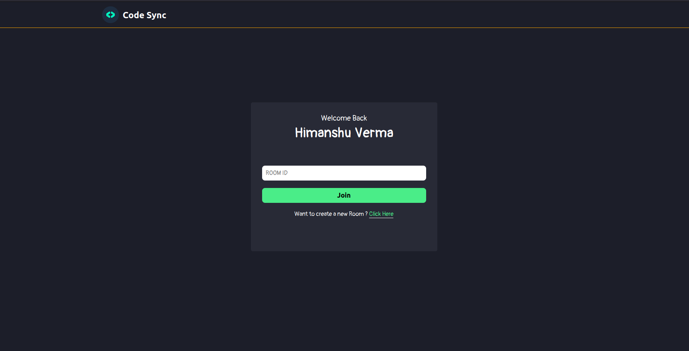
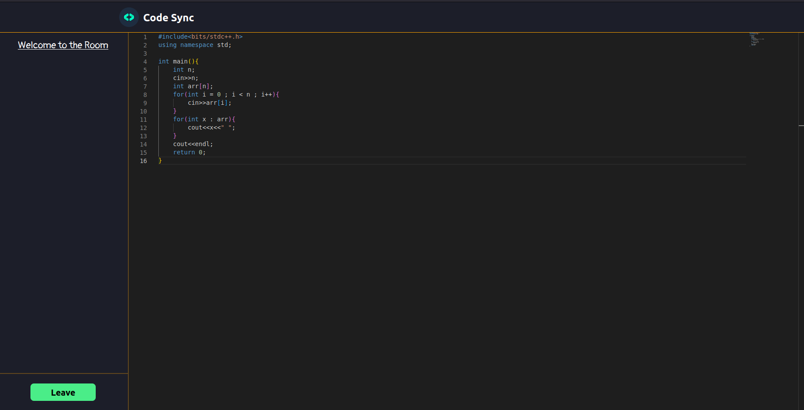

# Code Sync

This is a online code editor where multiple programmers can collaborate on the same code . 
Created using ReactJS , NodeJS , MongoDB with the help of Socket.io.

## Installation

1) Clone the Repository.
2) Run command `cd code-editor/backend` followed by `npm start` to start the backend .
3) Run command `cd code-editor/frontend` , followed by `npm run dev` .

## Images 

